# Base de datos objeto relacional con PostgreSQL

El presente ejercicio pretende realizar una base de datos objeto relacional que contenga información los empleados y proyectos de una empresa y como se relacionan.

## Requerimiento

### Diseño de una base de datos objeto-relacional para una empresa de gestión de empleados

Se te ha encomendado diseñar una base de datos objeto-relacional para una empresa de gestión de empleados. La base de datos debe almacenar información sobre los empleados, incluyendo su número de empleado, nombre, fecha de nacimiento y departamento. Además, se deben guardar los proyectos en los que cada empleado participa, con información sobre el nombre del proyecto, la fecha de inicio y el estado. Se conocen los siguientes requisitos:

- Cada empleado puede participar en múltiples proyectos.
- Cada proyecto puede tener múltiples empleados asignados.
- Se desea poder realizar consultas para obtener la lista de empleados y los proyectos en los que participan.

Diseña la estructura de la base de datos objeto-relacional para cumplir con los requisitos mencionados.

## Propuesta de la estructura de la base de datos

Para diseñar la base de datos objeto-relacional para la empresa de gestión de empleados, podemos utilizar tablas para representar las entidades y relaciones del sistema. A continuación, te presento el diseño de la base de datos:

### Tabla "persona":
nombre: Nombre de la persona.

f_nac: Fecha de nacimiento de la persona.

### Tabla "Empleados" (Heredada de la Tabla Padre "persona"):

nombre: Nombre del empleado (Heredado).

f_nac: Fecha de nacimiento del empleado (Heredado).

id_empleado (clave primaria): Identificador único del empleado.

departamento: Departamento al que pertenece el empleado.

### Tabla "Proyectos":

id_proyecto (clave primaria): Identificador único del proyecto.

n_proyecto: Nombre del proyecto.

f_inicio_proy: Fecha de inicio del proyecto.

estado_proyecto: Estado actual del proyecto.

### Tabla "empleados_proyecto":

id_empleado (clave primaria, clave foránea): Identificador del empleado que participa en el proyecto (relación con la tabla "empleado").

id_proyecto (clave primaria, clave foránea): Identificador del proyecto en el que participa el empleado (relación con la tabla "proyecto").

Con este diseño, podemos representar la relación entre empleados y proyectos a través de la tabla "empleados_proyecto". Cada fila esta tabla indicará qué empleado participa en qué proyecto, y se utilizarán las claves foráneas para asegurar la integridad referencial.

## Tecnologías utilizadas

- Docker
- PostgreSQL
- pgAdmin 4

## Replicación del ejercicio

1. Clonar este repositorio.
2. Abrir una terminal en el directorio del repositorio clonado.
3. Ejecutar en la terminale el siguiente comando: 

```bash
docker-compose up -d
```

4. En el navegador ingresar:

```bash
localhost:80
```

5. Iniciar sesión en el pgAdmin con los datos configuradoe en el archivo docker-compose y configurar el idioma español. 

usuario: admin@example.com
contraseña: admin123

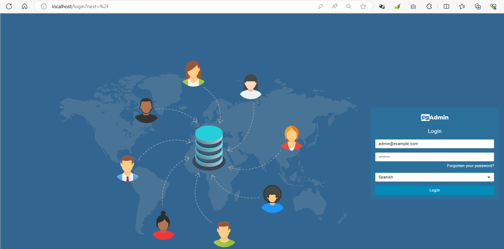

6. Ingreso al panel de pgAdmin y creamos una conexión al servicio PostgreSQL.

Para lo cual le damos Click en la opción '**Agregar un Nuevo Servidor**'.

En la pestaña **General** le asignamos un nombre: postgresql_docker.

En la pestaña **Conexión** le indicamos los siguientes datos, configurados previamente en el docker-compose:

- Nombre/dirección de servidor: postgres
- Puerto: 5432
- Nombre de usuario: dba1
- Contraseña: pwdba1

Y guardamos los datos.

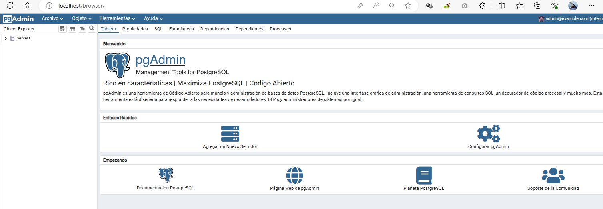

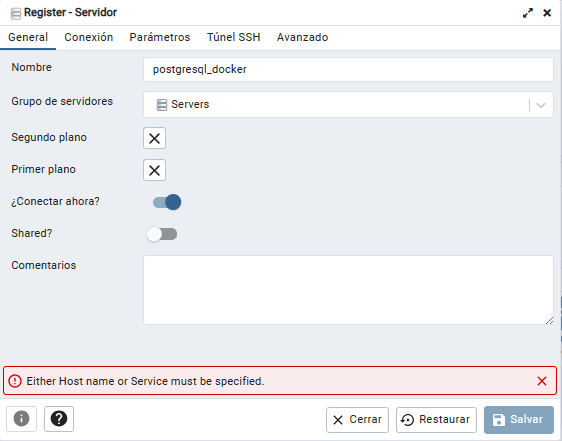

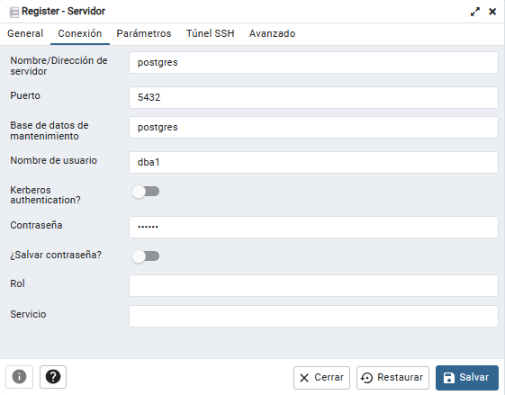

7. Verificación de la base de datos 'db_empresa' creada en el archivo docker-compose

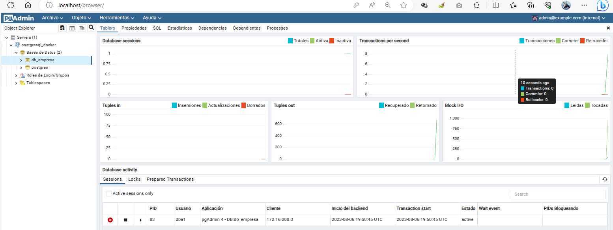

8. Para crear las tablas e insertar los datos que se encunetran en el archivo '**crear_base_datos.sql**' se le da click derecho sobre la base de datos **db_empresa** y luego click en la opción **Script CREATE**, para que nos de una pestaña para ejecutar sentencias **SQL**

9. Copiamos el contenido del archivo **crear_base_datos.sql** y lo pegamos en la pestaña creada en el paso anterior y después simplemente ejecutamos el Script.

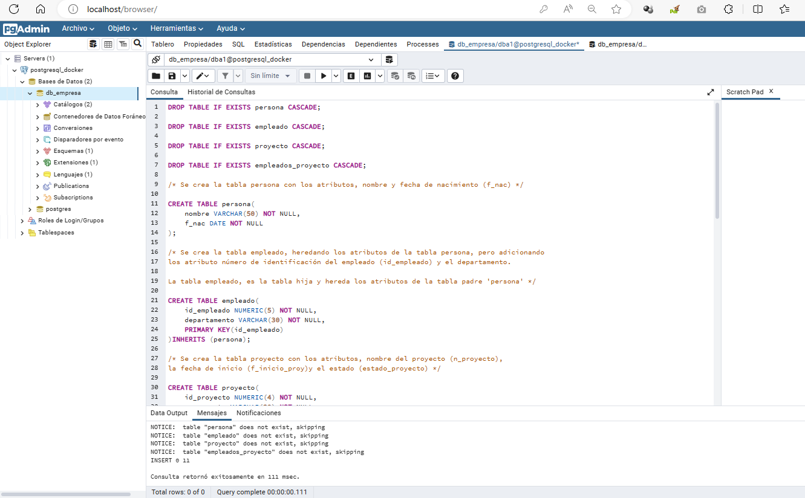

10. Se verifica que todas las tablas tengan los registros. Por ejemplo:

```sql
SELECT * FROM empleado;
```
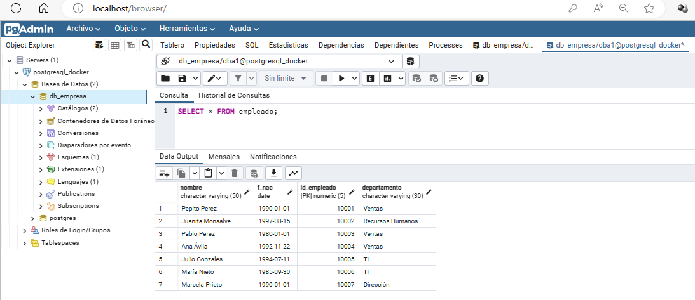

```sql
SELECT * FROM proyecto;
```
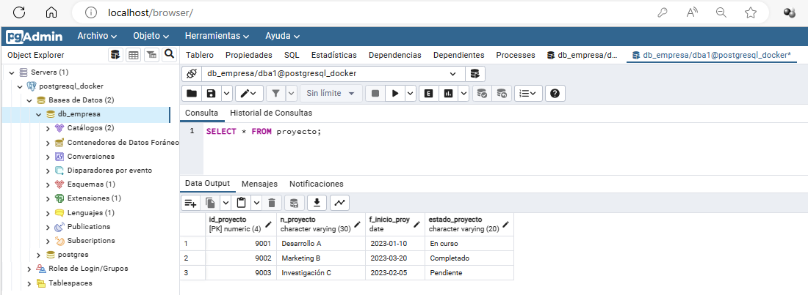

```sql
SELECT * FROM empleados_proyecto;
```
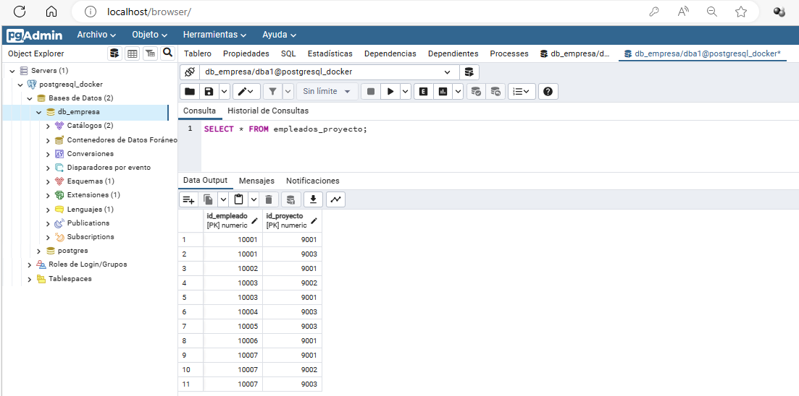

11. Ejecutamos consultas de interés del negocio, como por ejemplo:

- Cuales son los empleados y en que proyectos participan, versión sencilla:

Copiar y ejecutar la primera consulta del archivo **consultas.sql**

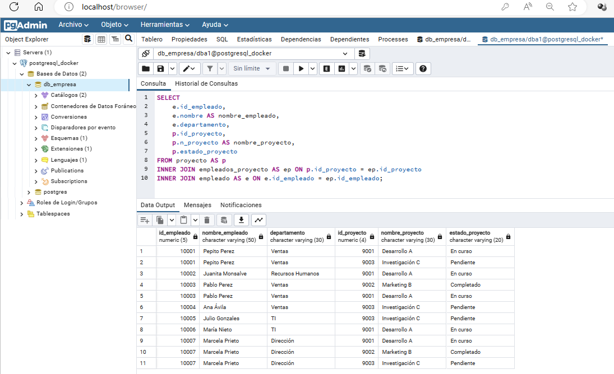

La consulta nos devolverá una lista de todos los empleados y los proyectos en los que participan. 
Cada fila representará un empleado con su información y el proyecto en el que está involucrado. 
Sí un empleado participa en múltiples proyectos, aparecerá una fila para cada proyecto en el que 
participa, con la información del empleado repetida en cada fila.

- Cuales son los empleados y en que proyectos participan, versión idónea:

Copiar y ejecutar la segunda consulta del archivo **consultas.sql**

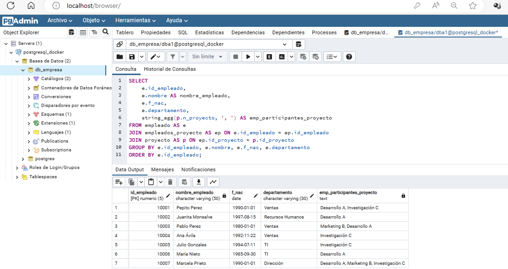

consulta nos devolverá una lista de empleados junto con los nombres de los proyectos 
en los que participan, todo en una sola fila por empleado. 

Si un empleado participa en varios proyectos, los nombres de los proyectos se concatenarán 
en la columna participantes_proyectos. Esto evita que se repita la información del empleado en 
filas separadas.